# 动力学约束下的路径规划
https://zhuanlan.zhihu.com/p/403822524
https://blog.csdn.net/qq_41694024/article/details/134446441
https://blog.csdn.net/weixin_43912423/article/details/131787511
https://github.com/Zhihaibi/MotionPlanning/tree/master/LatticePlanner
https://github.com/amslabtech/state_lattice_planner
https://blog.csdn.net/Amos98/article/details/123261802
https://blog.csdn.net/weixin_44673253/article/details/125114116
https://zhuanlan.zhihu.com/p/33741559
https://blog.csdn.net/NICAI001/article/details/107558962
https://zhuanlan.zhihu.com/p/483647239

## 介绍
一种生成机器人的运动同时受限制于运动学的约束（避障）以及动力学的约束（在速度加速度力的约束），既要保证运动的安全性（避障）还要保证微分的约束（力、加速度的约束）。
### Q1: 为什么要考虑动力学模型？
Kinodynamic : Kinematic + Dynamic

首先，为什么要kinodynamic呢，也就是考虑运动学和动力学（后续简称为动力学）呢？因为在现实世界中的机器人，他们是有自己的运动模型的，仅仅将他们转化为质点考虑运动路径肯定是有失偏颇的。

### Q2: 前端考虑动力学的重要性
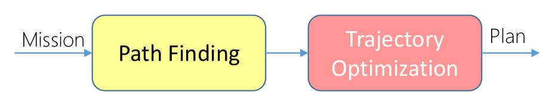
当然，前面其实提到过，在整个pipeline中，还有后端做轨迹优化的部分，会考虑到机器人的动力学，那在前端为什么要考虑动力学这个事情呢？

简单来讲，这样去做可以降低后续后端路径优化的负担。而且，后端优化的时候，往往都是在局部进行优化，如果前端完全不考虑动力学的话，可能会产生对于机器人来说动力学代价更大的路径。
### 经典的运动模型
#### 单轮机器人（Unicycle）模型

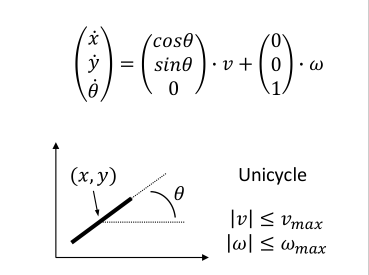

一个单轮机器人（Unicycle）模型的运动方程。单轮机器人模型是机器人学中一个常用的简化模型，用来近似描述差速驱动的机器人或车辆的运动，特别是当考虑平面运动时。这里，$( (x, y) )$ 表示机器人在平面上的位置，$( \theta )$ 是机器人前进方向与x轴的夹角，$( v )$ 是机器人沿着前进方向的线速度，$( \omega )$ 是机器人的角速度。

推导如下：

1. **位置和方向**:
   - $( x )$ 和 $( y )$ 表示机器人在二维空间中的位置坐标。
   - $( \theta )$ 表示机器人前进方向与x轴正方向的夹角，即机器人的朝向。

2. **速度分解**:
   - $( v )$ 是机器人沿其当前朝向的线速度。
   - $( \omega )$ 是机器人的角速度，即机器人朝向的变化率。

3. **运动方程**:
   - $( \dot{x} )$ 是x位置坐标随时间的变化率，即x方向的速度分量。
   - $( \dot{y} )$ 是y位置坐标随时间的变化率，即y方向的速度分量。
   - $( \dot{\theta} )$ 是朝向 $( \theta )$ 随时间的变化率，即角速度。

4. **运动学**:
   - 机器人在其当前朝向的线速度 $( v )$ 贡献了沿 $( \theta )$ 方向的速度分量。因此，$( \dot{x} )$ 和 $( \dot{y} )$ 的分量可以通过 $( v )$ 和 $( \theta )$ 用三角函数表示：
    - $( \dot{x} = v \cos(\theta) )$
    - $( \dot{y} = v \sin(\theta) )$
   - 机器人的角速度 $( \omega )$ 直接影响其朝向的变化率 $( \dot{\theta} )$，所以：
     - $( \dot{\theta} = \omega )$

5. **矩阵形式**:
   - 将以上分量放入矩阵形式中，可以更清晰地表示线速度和角速度对机器人状态的贡献：
$$
\begin{pmatrix}
\dot{x} \\
\dot{y} \\
\dot{\theta}
\end{pmatrix}
=
\begin{pmatrix}
\cos(\theta) \\
\sin(\theta) \\
0
\end{pmatrix}
\cdot v
+
\begin{pmatrix}
0 \\
0 \\
1
\end{pmatrix}
\cdot \omega
$$
这个方程反映了机器人的即时运动状态，它将机器人的线速度和角速度转换为在全局坐标系中的位置和朝向的变化率。这是非常基本的机器人运动学模型，是许多路径规划和控制算法的基础。
约束就是速度和角速度的最大值
#### 差速驱动机器人

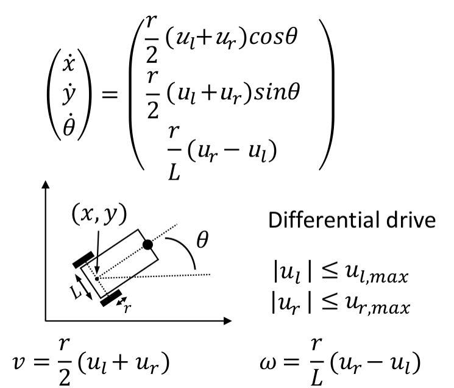

这个图像描述了差分驱动机器人的运动学模型。差分驱动模型是一种常见的移动机器人模型，它通过控制两个独立的车轮来实现机器人的运动。在这个模型中，$( u_l )$ 和 $( u_r )$ 分别代表左轮和右轮的速度输入，$( r )$ 是车轮半径，$( L )$ 是两车轮中心之间的距离，$( \theta )$ 是机器人的朝向，$( (x, y) )$ 是机器人在平面上的位置。

推导这个模型的步骤如下：

1. **轮速转换为线速度和角速度**:
   - 线速度 $( v )$ 由左右轮的速度平均值决定，而角速度 $( \omega )$ 由左右轮速度的差值决定，这反映了机器人转向的能力。具体的转换关系如下：
     - $( v = \frac{r}{2} (u_l + u_r) )$
     - $( \omega = \frac{r}{L} (u_r - u_l) )$

2. **轮速对位置的影响**:
   - 机器人的运动可以分解为沿着其朝向的平移运动和绕某一点的旋转运动。因此，机器人的位置变化率可以使用线速度和角速度来表达：
     - $( \dot{x} = v \cos\ (theta) )$
     - $( \dot{y} = v \sin\ (theta) )$
     - $( \dot{\theta} = \omega )$

3. **将线速度和角速度替换回轮速**:
   - 将 $( v )$ 和 $( \omega )$ 的表达式替换回 $( \dot{x} )$、$( \dot{y} )$ 和 $( \dot{\theta} )$ 中，我们得到：
     - $( \dot{x} = \frac{r}{2} (u_l + u_r) \cos\ (theta) )$
     - $( \dot{y} = \frac{r}{2} (u_l + u_r) \sin\ (theta) )$
     - $( \dot{\theta} = \frac{r}{L} (u_r - u_l) )$

4. **矩阵形式**:
   - 为了将这些方程表示为矩阵形式，我们合并上述方程并将其简化：

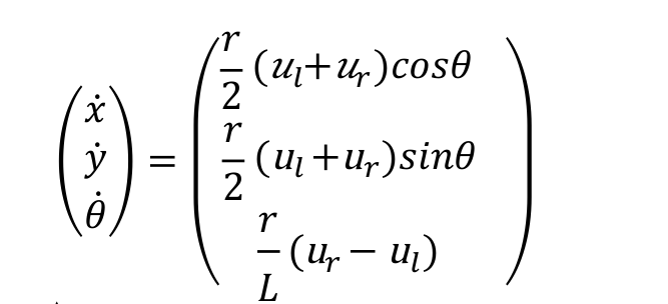

这个矩阵方程直接描述了机器人的即时运动状态，将左右轮的速度输入转换为全局坐标系中的位置和朝向的变化率。这是差分驱动机器人的基本运动学模型，是进行路径规划和控制算法设计时的基础。
## State Lattice Planning
状态栅格，顾名思义就在在普通的栅格化地图的基础上，加多了机器人运动学模型的约束，确保机器人能沿着相邻两点之间生成的路径运动，并且能够具有状态连续性（速度连续等）。

状态栅格规划是一种用于机器人和自动驾驶汽车的运动规划方法，它通过预定义的路径集合来实现从起点到终点的有效导航，同时考虑车辆的动力学限制和避免障碍物。下面是对状态栅格规划的详细介绍：
### 普通栅格(grid)与状态栅格的异同点
- 相同之处：它们都是将连续空间离散化，简化路径规划。

- 不同之处：状态点阵中，每个顶点的连线都是根据机器人的运动学模型生成的，都是切实可行的路径，而普通栅格(grid)的方法并没有结合模型，所以两点之间的路径，机器人并不一定能通过，举个例子：
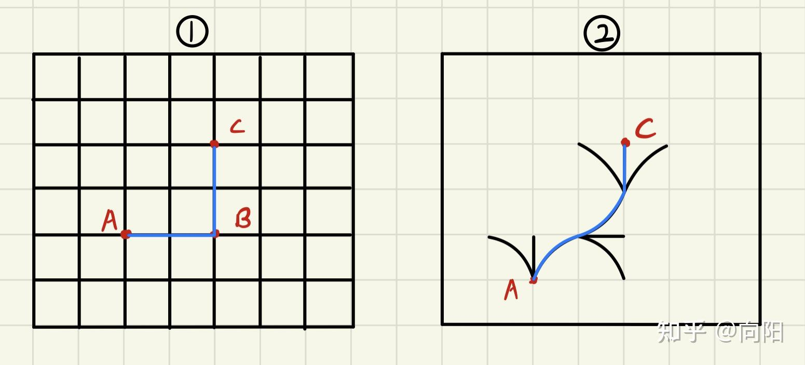

如果现在机器人是一辆四轮小车，图1是栅格地图，图二是根据四轮小车的运动学模型建立的规则点阵（红色点，没画全，意思一下）。假设小车初始角度水平向右，对于小车而言，图1的蓝色路径，它是没办法走的，因为B点处得转角是90度，而小车转弯是有一定弧度的，对于图2而言，假设小车将的转弯角度离散化成三个方向，每个节点之间的路径都可通行。
### 关键概念

- **状态空间表示**：在状态栅格规划中，"状态"通常指的是车辆的位置、速度、方向等属性的组合。状态空间是这些状态的集合，描述了车辆可能处于的所有状态。

- **栅格结构**：状态栅格通过将连续的状态空间离散化成有限的格点集合来构建。每个格点代表了一个特定的状态，而栅格中的路径则代表状态之间的可行转换。

- **轨迹生成**：为栅格中的每一对相邻状态计算一条轨迹，这些轨迹基于车辆的动力学模型预先生成，确保了从一个状态到另一个状态的转换在物理上是可行的。

- **搜索算法**：利用如A*或Dijkstra等搜索算法，在状态栅格中搜索从起始状态到目标状态的最优路径。这个过程涉及评估和比较不同路径的成本，如行驶距离、时间和能耗等。

### 优点

- **动力学符合性**：预计算的轨迹考虑了车辆的动力学限制，保证了规划路径的可行性和安全性。

- **高效性**：通过在离散化的栅格中进行搜索，状态栅格规划可以相对快速地找到解决方案，尤其是在高维状态空间中。

- **灵活性**：状态栅格规划适用于各种不同的环境和任务，能够处理静态和动态障碍物。
上传的图片中包含的文本内容是关于状态栅格规划（State Lattice Search）的说明。这里是对文本内容的解释：
### 说明
状态栅格规划是一种用于路径规划的方法，通过构建一个状态空间的栅格结构来进行。这个结构不仅包括机器人或自动车辆可能达到的所有状态，也包括了从一个状态到另一个状态的所有可行的动作序列，这些动作序列称为feasible motion connection。每个状态不仅包含位置信息，还可能包括速度、朝向等其他相关信息，而feasible motion connection则是指在物理和动力学限制下可实现的状态转换。

- **正向-离散化控制空间**：控制空间被离散化以生成feasible motion connection。
- **反向-离散化状态空间**：根据机器人目前的状态和目标状态，控制空间被离散化以生成状态转换的选择。

状态栅格搜索的核心是一个状态转换函数 $( s' = f(s, u) )$，表示从当前状态 $( s )$ 使用控制输入 $( u )$ 可以转换到新状态 $( s' )$。这是一个动力学模型，是路径规划中非常关键的一部分。

### 状态栅格生成

对于普通栅格点，直接给定栅格距离等，直接生成就好，而状态点阵需要结合机器人的运动空间去生成。

有两种生成方法，分别为对控制空间的采样和对状态空间的采样。

#### 控制空间的采样（前向采样）

已知机器人的运动学模型，则输入我们输入控制量 $( u )$ 和积分时间 $( T )$，向前积分预测后面时刻机器人的状态，代码里这里的操作是暴力遍历，从而得到一系列状态的集合，成为控制空间的采样。例如下图：

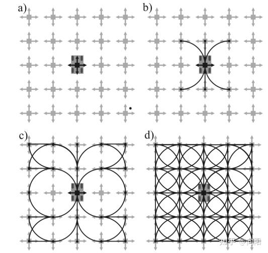

- (a) 图是四轮小车，(b) 图是小车当前可运动的六种可能性，(c) 是部分采样，(d) 是完全采样。

离散化控制空间是指给定系统不同的控制输入 $( u )$，并保持一定的时间，观察系统在不同激励下的响应。这种方法类似于前向仿真，易于实现，有点类似于 Dijkstra 算法，但缺乏目的性的扩展，容易造成较低的效率。
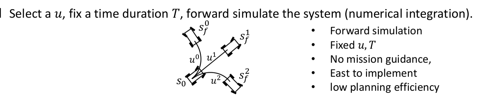

#### 状态空间的采样（逆向采样）

逆向，也就是指定了相邻点，结合机器人的模型，逆向算出当前点到相邻点的可能路径，放张图就很好理解前向和逆向采样的区别。
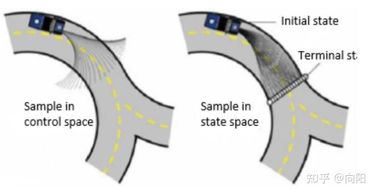

在状态空间采样中，选择一个终点的状态 $( s_f )$，从 $( s_0 )$ 到 $( s_f )$ 解出控制量 $( u )$ 和时间 $( T )$ （具有导向性和贪心性质）。
离散化状态空间是指给定状态，在两个状态之间解析运动的边（解出控制输入 $( u )$ 和时间 $( T )$），

观察哪些控制输入和时间能够使机器人从一个状态到达另一个状态。这种方法是反向的计算，比较难实现，但是自然地具备启发式（heuristic）的效果。
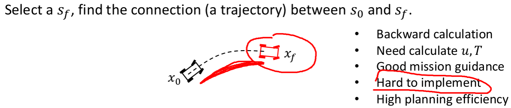
逆向采样的计算较为复杂，它涉及到了求解边界值问题（BVP）。经典的两点边界值问题是多项式方程求解系数的过程。

可以留意到，状态空间采样是考虑了目标点的反向规划，同时考虑了障碍物环境信息和机器人的运动学模型，所以相比于控制空间，状态空间采样更加常用。
### 在控制空间采样的示例
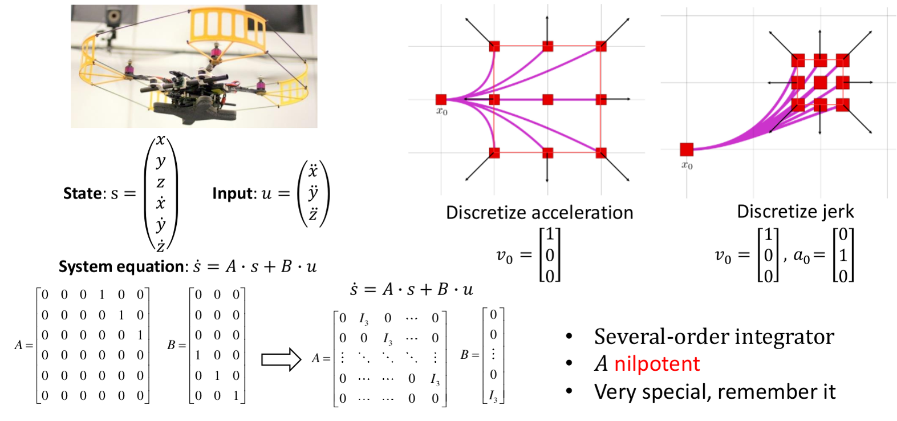

这张图片描述了一种运动模型，通常用于无人机或其他动力学系统的路径规划。模型包含状态向量、输入向量、系统方程，以及两种不同的离散化方法：离散化加速度和离散化加加速度（jerk）。

### 状态和输入

- **状态向量 $( s )$**: 包括无人机的位置 $( x, y, z )$ 和它们的一阶导数（速度）$( \dot{x}, \dot{y}, \dot{z} )$。
- **输入向量 $( u )$**: 包括加速度的分量 $( \ddot{x}, \ddot{y}, \ddot{z} )$。

### 系统方程

系统方程 $( \dot{s} = A \cdot s + B \cdot u )$ 描述了无人机状态的时间演化，其中：

- **矩阵 $( A )$**: 表示状态变量的时间演化，不包含控制输入。它是一个多阶积分器形式的矩阵，表示位置到速度的一阶积分关系。
- **矩阵 $( B )$**: 描述输入如何影响状态的变化。对于加速度输入，矩阵 $( B )$ 使输入向量 $( u )$ 直接影响状态向量 $( s )$ 的加速度分量。

### 离散化加速度和加加速度

图片右侧展示了如何离散化加速度和加加速度（jerk）：

- **离散化加速度**: 当我们只考虑初速度 $( v_0 )$ 时，加速度被设定为零。
- **离散化jerk**: 该方法考虑了初始速度 $( v_0 )$ 和初始加速度 $( a_0 )$，提供了一个更精细的模型，允许我们对无人机的运动进行更精确的控制。

### 特点
- **Nilpotent**: 这个术语描述了矩阵 $( A )$ 的性质，指当矩阵 $( A )$ 被多次乘以自己时，最终会变成零矩阵。这通常指矩阵有一个有限的幂次，超过这个幂次，矩阵会变为零。

要构建一个线性系统方程，可以使用位置和速度作为状态 $( s )$，加速度作为输入 $( u )$，从而得到如下形式的线性系统方程：

$$ \dot{s} = A \cdot s + B \cdot u $$

其中， $( \dot{s} )$ 表示状态 $( s )$ 的变化率， $( A )$ 和 $( B )$ 是系统的状态转移矩阵和输入矩阵。
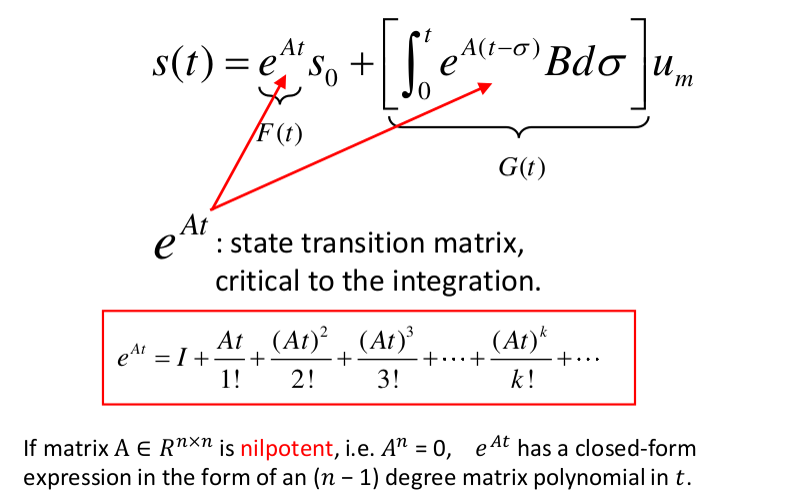

其中， $( s )$ 是状态向量，包括位置和速度， $( u )$ 是输入向量，包括加速度和可能的 jolt（jerk）。
#### 问题
对于随时间变化的状态函数 $s(t)$，它与初始状态 $s_{0}$ 和整个运动过程中选择的控制输入 $u_m$（常数）有关。我们想要知道在 $t = \tau$ 时刻状态 $s(\tau)$ 到底是什么。

目标是对给定的初始状态 $( s_0 )$（位置和速度），以及给定的加速度 $( u )$，在给定的时间 $( T )$ 后计算系统的最终状态 $( s_f )$（位置和速度）。这可以通过解线性系统的状态转移方程来实现。

对于高阶的情况，初始状态可以是速度和加速度，然后同样可以使用状态转移方程来计算系统在给定时间后的状态。

在实际操作中，您可以将初始状态和加速度作为输入，然后根据状态转移方程计算系统在 $( T = 1.0 )$ 时的最终状态。通过不断地改变初始状态和加速度的值，您可以得到系统在不同条件下的最终状态，从而了解系统的行为和响应。
为了构建离散的控制空间，可以选择一组初始速度，并在不同的加速度值下模拟系统的响应。这将产生离散的状态点，形成控制空间。
#### Lattice Graph 的概念

Lattice Graph 实际上是一个图，其中给定了一个初始状态（包括位置和速度），以及不同的控制输入（加速度），使系统能够到达每个可能的状态。通过在每个状态处应用不同的控制输入，我们可以在下一个状态重复这个过程，最终形成整个图。左图是九份离散化的图，右图是二十五份离散化的图。
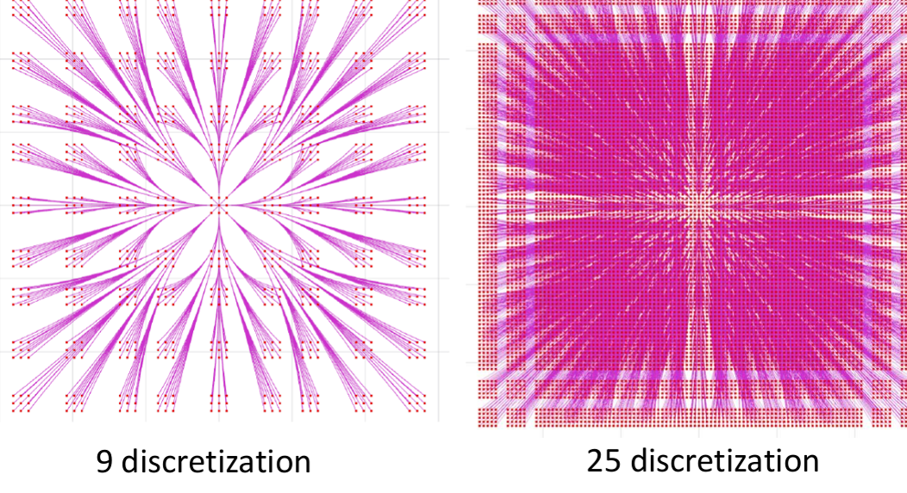

#### 搜索路径规划时的思考

在搜索基于规划的路径时，我们是否必须先给定初始状态，然后计算出所有的驱动信息（即构建完整的图）？实际上不是的！如果我们有一个非常好的启发式函数，我们就可以有目的地导向搜索，而不必完全构建整个图，从而节省计算和存储成本。

看起来，状态空间采样的方法要好一些，因为不会出现那些失败的路径。而且如果控制空间的输入变化的范围控制不好的话，可能会导致一系列的路径都容易是失败的，因为他们比较接近。那为什么不完全使用状态空间采样的方法呢，原因在于其实现的难度。下面介绍一下，已知起点终点状态，怎么去解中间的可行路径的一个方法。
## BVP
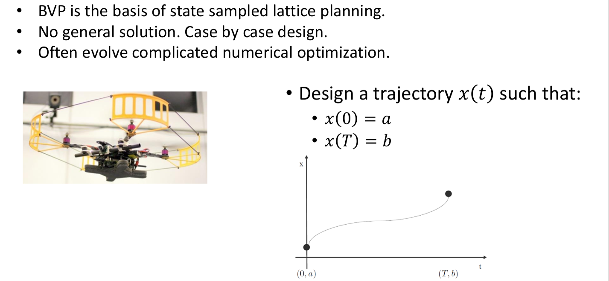

这张图片描述了边界值问题（Boundary Value Problem, BVP）在状态采样栅格规划（state sampled lattice planning）中的应用，并提到了轨迹设计的一般目标。
### 简单介绍

#### BVP和状态采样栅格规划

- **BVP**: 边界值问题是一类在两个或多个边界（时间或空间）上有预定义条件的数学问题。在状态采样栅格规划中，BVP通常指定了初始和终止状态，要求找到一个满足这些边界条件的路径或轨迹。
- **状态采样栅格规划**: 这是一种路径规划方法，它通过对状态空间进行采样并构建一个栅格来表示可行路径。BVP是这种规划方法的基础，因为它定义了从起点到终点的约束条件。

#### 轨迹设计
Boundary value problem (BVP)：给出机器人在起始点与终止点的状态，设计出一条状态转移的轨迹。是stated sampled lattice planning的基础，在motion planning技术栈中的位置如下。

Optimal boundary value problem：按某种原则设计出一条最优轨迹。
- **无通用解决方案**: 对于这种类型的问题，没有一个适用于所有情况的解决方案。设计轨迹需要根据具体问题的具体条件来确定。
- **经常涉及复杂的数值优化**: 为了找到满足边界条件的最优路径，通常需要利用数值优化方法。这些方法可能包括迭代算法、梯度下降、动态规划等。

#### 图中轨迹示例

- **轨迹设计目标**: 设计一个时间函数 $( x(t) )$，它描述了一个从点 $( a )$ 到点 $( b )$ 的路径，满足时间 $( t )$ 在 0 时的位置为 $( a )$，在 $( T )$ 时的位置为 $( b )$。
- 图中的轨迹展示了从点 $( (0, a) )$ 到点 $( (T, b) )$ 的示例路径，它可能表示无人机的飞行轨迹，需要在给定的时间内从一个位置移动到另一个位置。
### 无人机举例
一维的无人机系统，考虑起点的状态以及终点的状态，所以只考虑一个X轴，考虑这个轴上的参数的变化。现将X(t)进行多项式的参数化。最高次数可以自己选择，看提供的自由度。
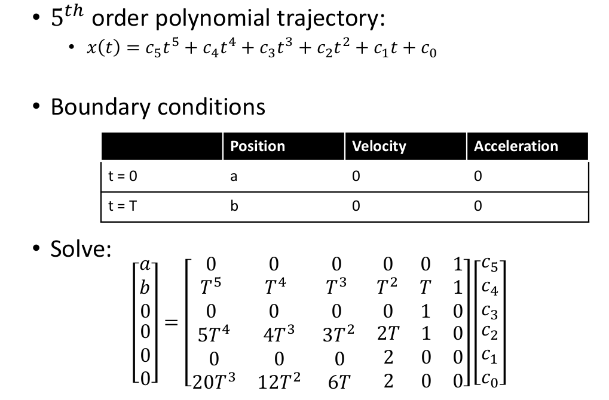
以上可能有很多解，因为限制条件比较少，获得一个解相对而言比较容易，但是获得比较优的解还需要其他的方法。从而引出OBVP
## Optimal Boundary Value Problem (OBVP)
### 建模
对于二维/三维空间中的机器人，通常在每个维度上分别进行轨迹设计。此处以三维空间中的无人机为例，考察其在一个轴向的运动。

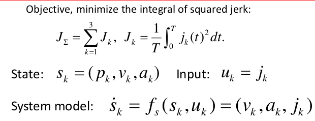
---

无人机状态变量 $ s = (ρ, v, a) $

使用Jerk作为控制输入：$u = j$

状态方程：
$$ \dot{s} = f_s(s, u) = (v, a, j) $$

这个公式是一个动态系统的状态方程。状态方程描述了系统状态随时间的变化情况。在这个公式中，状态向量 $( s )$ 由位置 $( \rho )$（通常用 $( p )$ 或 $( x )$ 表示，但在这里用 $( \rho )$），速度 $( v )$，和加速度 $( a )$ 组成。状态的变化率用导数表示，即 $( \dot{s} )$。

在给定的动态系统中，控制输入 $( u )$ 是指“jerk” $( j )$，它是加速度的变化率，或者说是速度的二阶导数。状态方程的形式通常是基于牛顿第二定律 $( F = m \cdot a )$ 推导出来的，其中 $( F )$ 是作用力，$( m )$ 是质量，$( a )$ 是加速度。在动态模型中，假设是一个质点，可以忽略质量的影响，因此控制输入直接作为加速度的变化率，即 jerk。

对于这个方程：
$$ \dot{s} = f_s(s, u) = (v, a, j) $$

它表达了以下关系：

- 位置 $( \rho )$ 的变化率（即速度 $( v )$）是状态向量的第一个分量。
- 速度 $( v )$ 的变化率（即加速度 $( a )$）是状态向量的第二个分量。
- 加速度 $( a )$ 的变化率（即 jerk $( j )$）是状态向量的第三个分量，也是控制输入 $( u )$。

所以，这个状态方程直接表示了位置、速度和加速度随时间的变化，以及它们是如何被控制输入 $( j )$ 所影响的。这个方程通常不是简单地“推导”出来的，而是基于系统的物理特性和定义构建的。

目标：最小化Jerk二次方的积分，即
$$ \min J = \frac{1}{T} \int_0^T j(t)^2 dt $$

控制输入的是 $ u(t) $

---
$状态变量 s 代表了位置 ρ、速度 v 和加速度 a。控制输入 u 是加加速度 j，即加速度的导数。状态方程代表了状态变量的导数作为状态和控制输入的函数。$

$目标函数 J 是要最小化时间间隔从 0 到 T 的加加速度 j(t) 的平方的积分，通过 T 进行归一化，这是在最优控制问题中常见的目标，用以确保运动的平滑性。$
### 求解

寻找最优轨迹的一般形式是极小化代价函数

---

成本函数 $( J )$ 定义为：
$$ J = h(s(T)) + \int_0^T g(s(t), u(t)) \cdot dt $$

在这里，$( h(s(T)) )$ 是末态成本函数，它表示在终止时间 $( T )$ 时系统状态 $( s )$ 的成本。而 $( g(s(t), u(t)) )$ 是过渡成本函数，它表示在整个时间范围内，状态 $( s(t) )$ 和控制 $( u(t) )$ 所带来的成本。

庞特里亚金最小原理是一种求解最优控制问题的方法，它利用co-state变量 $( \lambda(t) )$ 来构建Hamilton函数 $( H )$，它结合了系统的动力学（通过 $( f_s(s, j) )$ 函数）和控制成本。通过最小化Hamilton函数，可以找到最优的控制策略 $( u(t) )$。

在这个特定的例子中，$( j )$ 是控制输入（即加速度的导数或者说是jerk），$( \lambda )$ 是与系统状态变量相对应的co-state变量。Hamilton函数包含了控制输入的平方项（表示控制成本）和co-state变量与状态方程的乘积（表示系统的动态）。

此处的目标是找到控制输入 $( j )$ 的最优时间序列，从而使成本函数 $( J )$ 最小化。这通常涉及到设置哈密顿函数的导数为零，并求解相应的哈密顿系统，从而得到最优路径。
其中，第一项反映了在 $( T )$ 时刻状态 $( s )$ 的末态成本，第二项则反映了从 $( 0 )$ 到 $( T )$ 时刻的过渡成本（transition cost）。

为求解最优控制 $( u(t) )$（即最优的 $( j )$），可以使用庞特里亚金最小原理。引入co-state $( \lambda = (\lambda_1, \lambda_2, \lambda_3) )$，（实际上是 $( \lambda(t) )$ = $( (\lambda_1(t), \lambda_2(t), \lambda_3(t)) )$），并形成哈密顿函数 Hamiltonian function

$$ H(s, j, \lambda) = \frac{1}{T} j^2 + \lambda^T f_s(s, j) $$
$$ = \frac{1}{T} j^2 + \lambda_1 v + \lambda_2 a + \lambda_3 j $$

---
**哈密顿函数为什么这样定义？**

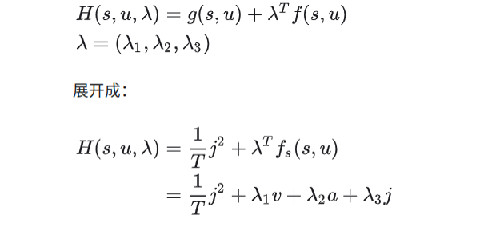

哈密顿函数 $( H(s, u, \lambda) )$ 定义如下：

$$ H(s, u, \lambda) = g(s, u) + \lambda^T f(s, u) $$

这里 $( g(s, u) )$ 是系统的即时成本函数，通常取决于状态 $( s )$ 和控制输入 $( u )$。在最优控制问题中，$( g(s, u) )$ 通常是我们想要最小化的量，例如能量消耗、路径长度或者，如您的例子中的，加加速度（jerk）的平方。

$( \lambda )$ 是协态向量，其中 $( \lambda = (\lambda_1, \lambda_2, \lambda_3) )$，它代表了与状态变量相关的拉格朗日乘子。

$( f(s, u) )$ 是系统的动态方程，它描述了状态如何随时间演变。

所以，展开哈密顿函数 $( H(s, u, \lambda) )$ 的表达式时，我们有：

- $( g(s, u) )$ 在这个例子中特别指的是 $( \frac{1}{T} j^2 )$，这是因为我们的目标是最小化加加速度（jerk）的平方，所以即时成本函数 $( g(s, u) )$ 就是 $( \frac{1}{T} j^2 )$。
- $( \lambda^T f(s, u) )$ 是协态向量 $( \lambda )$ 和系统动态 $( f(s, u) )$ 的内积，其中 $( f(s, u) )$ 被定义为系统状态的变化率，也就是 $( (\dot{v}, \dot{a}, \dot{j}) )$。

因此，根据哈密顿函数的定义，我们将 $( g(s, u) )$ 和 $( \lambda^T f(s, u) )$ 结合起来得到：

$$ H(s, u, \lambda) = \frac{1}{T} j^2 + \lambda_1 \dot{v} + \lambda_2 \dot{a} + \lambda_3 \dot{j} $$

这里：

- $( \frac{1}{T} j^2 )$ 表示加加速度的平方除以时间间隔 $( T )$，它是性能指标的一部分。
- $( \lambda_1 \dot{v} )$ 表示协态 $( \lambda_1 )$ 乘以速度 $( v )$ 的变化率。
- $( \lambda_2 \dot{a} )$ 表示协态 $( \lambda_2 )$ 乘以加速度 $( a )$ 的变化率。
- $( \lambda_3 \dot{j} )$ 表示协态 $( \lambda_3 )$ 乘以加加速度 $( j )$ 的变化率。

综合这些，哈密顿函数 $( H(s, u, \lambda) )$ 就提供了一个量化整个系统性能的标准，这包括即时成本和对未来状态变化的评估。在最优控制问题中，我们寻找的控制策略 $( u(t) )$ 将最小化这个哈密顿函数。

### 即时成本函数为什么不是 $\min J = \frac{1}{T} \int_0^T j(t)^2 dt$这个函数呢？
- 在最优控制理论中，即时成本函数（也称为运行成本、路径成本或阶段成本）通常是对系统状态和控制输入的即时评价，它描述了在特定时间点上应用特定控制输入的成本。此成本函数随时间积分，可以产生整个时间段的总成本。

- 在哈密顿函数 $( H(s, u, \lambda) = g(s, u) + \lambda^T f(s, u) )$ 中，$( g(s, u) )$ 就是即时成本函数，可以是任意形式，它直接影响整个系统性能的评价。在您的情况中，如果即时成本函数被选为 $( \frac{1}{T} j^2 )$，那么它就是在最小化加加速度的平方，这是一种特定选择，反映了对平滑轨迹的偏好。

- 哈密顿函数中的 $( g(s, u) )$ 项可以根据实际问题的需要来设定。如果问题是最小化加加速度的平方，则 $( g(s, u) )$ 应该设置为 $( \frac{1}{T} j^2 )$。在一些情况下，$( g(s, u) )$ 可能还包括其他形式的成本，比如能量消耗、时间延迟或其他性能指标。选择 $( g(s, u) )$ 的形式取决于我们想要系统优化的目标。

--- 

### 哈密顿函数的详细解释

在最优控制问题中，哈密顿函数 $( H )$ 是构造最优解的关键组成部分。在使用庞特里亚金最小原理（Pontryagin's Minimum Principle）解决最优控制问题时，哈密顿函数的定义包含了系统的动力学和优化目标。在给出的公式中：

$$
H(s, u, \lambda) = \frac{1}{T} j^2 + \lambda^T f_s(s, u)
$$

$$
= \frac{1}{T} j^2 + \lambda_1 v + \lambda_2 a + \lambda_3 j
$$

哈密顿函数包括两部分：

1. **目标函数（Cost Function）的一部分**:
   - 这里 $( \frac{1}{T} j^2 )$ 是被优化的性能指标，代表平方加加速度（jerk）的积分，它被用来衡量轨迹的平滑性。加加速度的平方通常用于最小化因为它惩罚大的加加速度值，这在物理系统中可能代表更少的能耗或更平稳的运动。将其乘以 $( \frac{1}{T} )$ 是为了正规化，以确保这个性能指标与规划时间 $( T )$ 的长度无关。

2. **系统动力学**:
   - $( \lambda^T f_s(s, u) )$ 是系统动力学函数，其中 $( \lambda )$ 是协态向量（也称作拉格朗日乘数或影子价格），它表明在最优轨迹中，状态变量如何随时间变化。动力学函数 $( f_s(s, u) )$ 描述了系统状态的变化率，依赖于当前状态和控制输入。

哈密顿函数 $( H )$ 被用来构建一个系统，其中不仅包括了最小化目标，还包括了动力学约束。在解决最优控制问题时，我们不仅要找到一个最小化目标函数的控制输入，还要确保这个控制输入是在系统的动力学约束下可行的。

在庞特里亚金最小原理中，最优控制问题的解决方案是通过最小化哈密顿函数来找到的。这涉及到计算协态向量 $( \lambda )$ 的演化（通过协态方程），以及确定在每一个时间点上最小化哈密顿函数的控制输入 $( u )$。最终，这个过程会导出一个控制策略，该策略随时间变化，并满足初值和终值条件，同时最小化了给定的性能指标。

---

### 建模（Modelling）

- **目标（Objective）**: 最小化加加速度的平方积分，即 $( J_Σ = \sum_{k=1}^{3} J_k )$，其中 $( J_k = \frac{1}{T} \int_{0}^{T} j_k(t)^2 dt )$。
- **状态（State）**: 状态 $( s_k )$ 包括位置 $( p_k )$，速度 $( v_k )$，加速度 $( a_k )$。
- **输入（Input）**: 输入 $( u_k )$ 是加加速度 $( j_k )$。
- **系统模型（System model）**: 系统模型描述为 $( \dot{s} = f_s(s, u) = (v, a, j) )$，即状态的导数由速度、加速度和加加速度组成。
---
### 解决（Solving）

- **最小作用原理（Pontryagin's minimum principle）**: 首先引入协态 $( \lambda = (\lambda_1, \lambda_2, \lambda_3) )$。
- **定义哈密顿函数（Hamiltonian function）**:
  $$
  H(s, u, \lambda) = \frac{1}{T} j^2 + \lambda^T f_s(s, u)
  $$
  $$
  = \frac{1}{T} j^2 + \lambda_1 v + \lambda_2 a + \lambda_3 j
  $$
---
### 最小作用原理（minimum principle）

- **状态方程（System equation）**: $( \dot{s}^*(t) = f_s(s^*(t), u^*(t)) )$，给定初始条件 $( s^*(0) = s(0) )$。
- **协态方程（Costate equation）**: $( \dot{\lambda}(t) = -\nabla_s H(s^*(t), u^*(t), \lambda(t)) )$。
- **边界条件（Boundary condition）**: $( \lambda(T) = -\nabla_h(s^*(T)) )$。
  - **如果边界条件不确定，则公式2边界条件公式成立。h被定义成终末状态的函数。这个公式代表终末状态时间T的时候，协态与终末状态中最优的自由量的梯度的和等于0. 比如说，我们要求上面的问题中的终末状态的p,v,a均达到指定状态，那么这个公式就没了，因为终末状态没有任何自由度，如果说我们只希望终末状态的位置p达指定状态，v,a无所谓，那么我们可以根据这个公式写出两个边界条件。**

- **最优控制输入（Optimal control input）**: $( u^*(t) = \text{arg min}_{u(t)} H(s^*(t), u(t), \lambda(t)) )$。

最小作用原理（Pontryagin's Minimum Principle）是解决最优控制问题的一种方法。它提供了寻找使得性能指标最小化的控制变量的系统的一组必要条件。在最优控制问题中，我们通常有以下几个关键的函数和概念：

1. **状态方程** $( \dot{s}^*(t) = f_s(s^*(t),u^*(t)) )$：这表示系统的动态，即系统如何随时间和控制输入变化。状态 $( s^*(t) )$ 是系统在时间 $( t )$ 的状态，而 $( u^*(t) )$ 是在时间 $( t )$ 应用的最优控制输入。

2. **协态方程** $( \dot{\lambda}(t) = -\nabla_s H(s^*(t),u^*(t),\lambda(t)) )$：协态 $( \lambda(t) )$ 通常被视为系统状态的“影子价格”，它反映了状态在优化过程中的价值。协态的变化率（$( \dot{\lambda}(t) )$）是哈密顿函数 $( H )$ 关于状态的梯度的负值。这个负梯度表示了在最优路径上，状态变量的一个小的改变会如何影响整个系统性能。

3. **哈密顿函数** $( H(s,u,\lambda) = \frac{1}{T}j^2 + \lambda^T f_s(s,u) )$：它是性能指标和系统动态的结合。在最优控制问题中，哈密顿函数通常包括两部分：一部分是与控制变量直接相关的性能指标，另一部分是协态向量和系统动态的乘积。哈密顿函数提供了评估控制策略质量的标准。

4. **边界条件** $( \lambda(T) = -\nabla_h(s^*(T)) )$：在最优控制问题的终点，协态必须满足特定的边界条件。在这里，协态在最终时间 $( T )$ 的值由性能指标 $( h )$ 关于状态的梯度确定。

5. **最优控制输入** $( u^*(t) = \text{arg min}_{u(t)} H(s^*(t),u(t),\lambda(t)) )$：这是最优控制问题的核心。它表示，要找到最优控制策略，我们需要选择那些最小化哈密顿函数的控制输入。这个最小化过程通常涉及对控制变量进行求导并设置等于零，从而解出使哈密顿函数最小的控制变量的值。

最小作用原理提供了一组求解最优控制问题的方程和条件。在实际应用中，这些方程通常需要通过数值方法来求解，因为它们很少有解析解。

在这个优化问题中，我们通过调整输入 $( u )$，来找到使得 $( J_Σ )$ 最小的状态轨迹。这涉及到使用最小作用原理来确定最优控制输入，它要求我们定义哈密顿函数，并找到使得哈密顿函数最小化的控制输入。协态变量 $( \lambda )$ 用于连接状态变量和控制变量，其方程和边界条件则通过哈密顿函数定义。最优轨迹 $( s^*(t) )$ 和最优控制 $( u^*(t) )$ 需要同时解决状态方程和协态方程，满足初始和终止的边界条件。这类问题通常需要通过数值方法来解决，因为它们可能没有解析解。
### 根据以上最小值原理的三个公式求解问题

#### 根据公式一
- **协态方程（Costate equation）**:
  $$( \dot{\lambda}(t) = -\nabla_s H(s^*(t), u^*(t), \lambda(t)) )$$

协态方程 $( \dot{\lambda} = -\nabla_s H(s, u, \lambda) )$ 描述了协态如何随时间变化。
   
在最优控制理论中，协态方程 $( \dot{\lambda}(t) = -\nabla_s H(s, u, \lambda) )$ 指出协态 $( \lambda )$ 的变化率是哈密顿函数 $( H )$ 对系统状态 $( s )$ 的梯度的负值。这里的梯度 $( \nabla_s H )$ 考虑了 $( H )$ 对所有状态变量的偏导数。

哈密顿函数 $( H )$ 被定义为

$$ H(s, u, \lambda) = \frac{1}{T}j^2 + \lambda_1 v + \lambda_2 a + \lambda_3 j $$

那么 $( \nabla_s H )$ 将包括 $( H )$ 对每个状态变量的偏导数。根据定义，状态向量 $( s )$ 包含位置、速度和加速度，因此在这个例子中 $( s = (p, v, a) )$。但是哈密顿函数中只有速度 $( v )$ 和加速度 $( a )$ 与协态变量 $( \lambda_1 )$ 和 $( \lambda_2 )$ 相乘，而位置 $( p )$ 没有出现在 $( H )$ 中。

由于哈密顿函数 $( H )$ 不直接依赖于位置 $( p )$，所以 $( H )$ 对位置 $( p )$ 的偏导数为 0，这解释了 $( \dot{\lambda} )$ 的第一个分量为 0。而 $( H )$ 对速度 $( v )$ 和加速度 $( a )$ 的偏导数分别是协态变量 $( \lambda_1 )$ 和 $( \lambda_2 )$，这就是为什么 $( \dot{\lambda} )$ 的第二个和第三个分量是 $( -\lambda_1 )$ 和 $( -\lambda_2 )$。

请注意，$( H )$ 中的加加速度 $( j )$ 是控制变量，而不是状态变量，因此它不直接参与到 $( \nabla_s H )$ 的计算中。

总结一下，梯度 $( \nabla_s H )$ 是：

- 对 $( p )$ 的偏导数为 0，因为哈密顿函数 $( H )$ 中没有 $( p )$ 的项。
- 对 $( v )$ 的偏导数为 $( \lambda_1 )$，因为 $( H )$ 与 $( v )$ 的项是 $( \lambda_1 v )$。
- 对 $( a )$ 的偏导数为 $( \lambda_2 )$，因为 $( H )$ 与 $( a )$ 的项是 $( \lambda_2 a )$。

**这就是为什么协态 $( \lambda )$ 的变化率 $( \dot{\lambda} )$ 是 $( (0, -\lambda_1, -\lambda_2) )$，即 $( \nabla_s H(s, u, \lambda) )$ 的负值。**

---
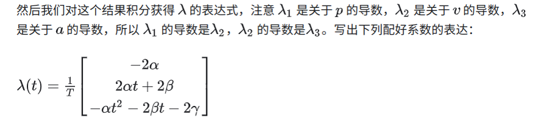

#### 根据公式四

 **最优控制输入（Optimal control input）**: 
 $$( u^*(t) = \text{arg min}_{u(t)} H(s^*(t), u(t), \lambda(t)) )$$
 
 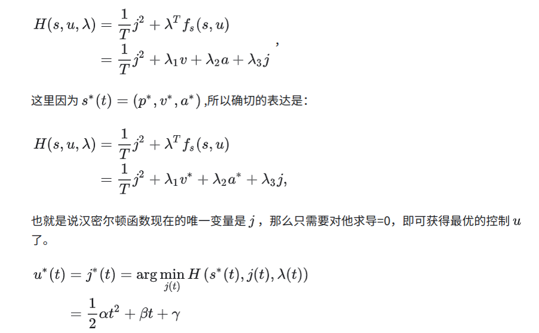
 
- 相关推导：

1. **最优状态和控制**:
   这里假设了最优状态 $( s^*(t) = (p^*, v^*, a^*) )$ 和最优控制输入 $( u^*(t) )$，并且用它们替换了 $( H )$ 中的 $( s )$ 和 $( u )$。

2. **最小化哈密顿函数**:
   $$ u^*(t) = j^*(t) = \text{arg min}_{j(t)} H(s^*(t), j(t), \lambda(t)) $$
   要找到使哈密顿函数最小的控制输入 $( j(t) )$，需要对 $( H )$ 关于 $( j )$ 进行微分，并将导数设为零。

3. **求解控制输入**:
   通过对哈密顿函数求导并等于零，可以得到最优控制输入的表达式：
   $$ \frac{d}{dj}(\frac{1}{T}j^2 + \lambda_3 j) = 0 $$
   解这个方程得到：
   $$ \frac{2}{T}j + \lambda_3 = 0 $$
   $$ j = -\frac{T}{2}\lambda_3 $$

4. **替换协态变量的表达式**:
   根据协态 $( \lambda )$ 的先前给定的表达式：
   $$ \lambda_3(t) = -\alpha t^2 - 2\beta t - 2\gamma $$
   最优控制输入 $( u^*(t) = j^*(t) )= \frac{1}{2}\alpha t^2 + \beta t + \gamma$

 现在有了最优的控制($jerk$ )表达式，进行一次积分获得$a$ ,在积分获得 $v$ ,在积分获得 $p$ ，于是：
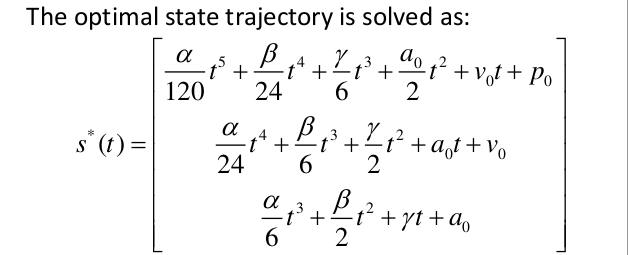

## 相关知识补充

### 哈密顿函数 Hamiltonian function

在最优控制中，变量分为两类，一类是状态变量：即有微分方程约束的变量，意如其字，状态变量的变化一定是连续的变化，本期的值会影响到下一期的值，在时间上呈现连续的变化。另一类是控制变量，即没有微分方程约束的变量，可以连续变化，也可以跳跃变化。

面对诸如以下问题时，可以用最优控制理论的方法解决：

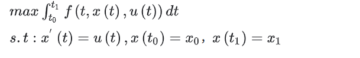

---

这张图片展示了一个经典的最优控制问题的形式化描述和解法。

目标是最大化积分 $( \int_{t_0}^{t_1} f(t, x(t), u(t)) dt )$，同时满足动态系统的状态方程 $( \dot{x}(t) = u(t) )$，以及初始和终止条件 $( x(t_0) = x_0 )$ 和 $( x(t_1) = x_1 )$。

控制变量 $( u(t) )$ 应该选择使得上述积分最大。解决这类问题的标准方法是使用哈密顿函数

哈密顿函数：
$$ H = f(t, x(t), u(t)) + \lambda(t) g(t, x(t), u(t)) $$

控制变量的最优条件（最大化哈密顿函数）是：
$$ \frac{\partial H}{\partial u} = 0 \Rightarrow f_u + \lambda g_u = 0 $$

状态变量的演化由哈密顿函数对状态变量的偏导数确定（即共轭变量的动态方程）：
$$ -\dot{\lambda} = \frac{\partial H}{\partial x} = -\

\lambda' $$
$$ f_x + \lambda g_x = -\lambda' $$
$$ \lambda(t_1) = 0 $$

其中 $( f_u )$, $( f_x )$, $( g_u )$, $( g_x )$ 分别表示函数 $( f )$ 和 $( g )$ 对控制变量 $( u )$ 和状态变量 $( x )$ 的偏导数。这些条件一起定义了所谓的最优控制问题的必要条件。

通过解决这些方程，可以找到最优的控制路径 $( u(t) )$ 和状态路径 $( x(t) )$。这些原则是基于庞特里亚金最小原理，是解决连续时间最优控制问题的标准方法。

---

### 哈密尔顿函数法求解最优控制问题的具体过程
- 构造广义哈密顿函数 $( H = L + \lambda^T f )$，其中 $( L )$ 是拉格朗日量，$( f )$ 是系统的动态方程，$( \lambda )$ 是拉格朗日乘数（也就是协状态变量）。
- 协状态变量的演化方程是 $( \dot{\lambda} = -\frac{\partial H}{\partial x} )$，控制变量的最优条件是 $( \frac{\partial H}{\partial u} = 0 )$。
- 状态变量的演化方程是 $( \dot{x} = f(x, u, t) )$。
- 最终需要求解的是在终端时间 $( t_f )$ 处，状态变量 $( x(t_f) )$，协状态变量 $( \lambda(t_f) )$，以及哈密顿函数 $( H(x, t_f) )$ 的值。
- 这会构成一个Hamilton系统。

### 庞特里亚金最小原理（Pontryagin's Minimum Principle）

- **状态方程（System equation）**: $( \dot{s}^*(t) = f_s(s^*(t), u^*(t)) )$，给定初始条件 $( s^*(0) = s(0) )$。
- **协态方程（Costate equation）**: $( \dot{\lambda}(t) = -\nabla_s H(s^*(t), u^*(t), \lambda(t)) )$。
- **边界条件（Boundary condition）**: $( \lambda(T) = -\nabla_h(s^*(T)) )$。
- **最优控制输入（Optimal control input）**: $( u^*(t) = \text{arg min}_{u(t)} H(s^*(t), u(t), \lambda(t)) )$。

 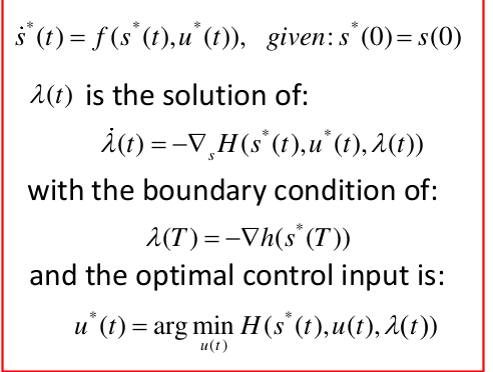

图中展示的是最优控制问题中的一些关键方程，这些方程是按照Pontryagin最小作用原理得出的。下面是这些方程的详细解释：

1. **状态方程**:
   
   $$ \dot{s}^*(t) = f(s^*(t), u^*(t)) $$
   这个方程定义了系统的动态行为。状态 $( s^*(t) )$ 表示最优状态轨迹，而 $( u^*(t) )$ 表示最优控制输入。$( \dot{s}^*(t) )$ 是状态 $( s^*(t) )$ 的时间导数，即状态随时间的变化率。方程表明状态的变化是由当前状态和控制输入共同决定的。给定条件 $( s^*(0) = s(0) )$ 确定了初始状态，是求解动态系统必需的初始条件。

3. **协态方程**:
   
   $$ \dot{\lambda}(t) = -\nabla_s H(s^*(t), u^*(t), \lambda(t)) $$

   协态 $( \lambda(t) )$ 是一个辅助变量（也称作拉格朗日乘子），用于反映在最优轨迹上状态变量的边际价值。协态方程描述了这些协态如何随时间变化。这里的 $( -\nabla_s H )$ 表示哈密顿函数 $( H )$ 关于状态变量 $( s )$ 的梯度的负值。这个负梯度反映了状态在最优轨迹上如何影响整个系统性能。

4. **边界条件**:
   
   $$ \lambda(T) = -\nabla_h(s^*(T)) $$
   这是协态方程的边界条件。在最优控制问题的终点，协态必须满足特定的条件。这里的 $( -\nabla_h(s^*(T)) )$ 表示在终点状态 $( s^*(T) )$ 时，终点状态成本函数 $( h )$ 关于状态 $( s )$ 的梯度的负值。

5. **最优控制输入**:

   $$ u^*(t) = \text{arg min}_{u(t)} H(s^*(t), u(t), \lambda(t)) $$
   这个表达式定义了最优控制输入 $( u^*(t) )$，即在每一个时间点 $( t )$，我们选择使哈密顿函数 $( H )$ 最小的控制输入。$( \text{arg min} )$ 运算符表示寻找使得函数 $( H )$ 最小化的 $( u(t) )$ 的值。

哈密顿函数 $( H )$ 通常定义为系统性能指标和系统动态的组合，它在最优控制理论中充当连接当前状态、控制输入和协态的桥梁。这些方程一起形成了寻找最优状态和控制策略的解的基础。

